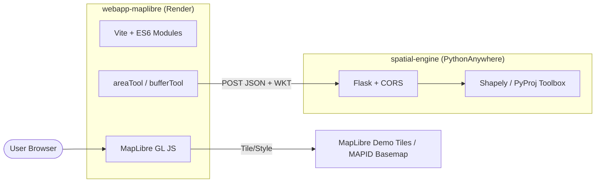
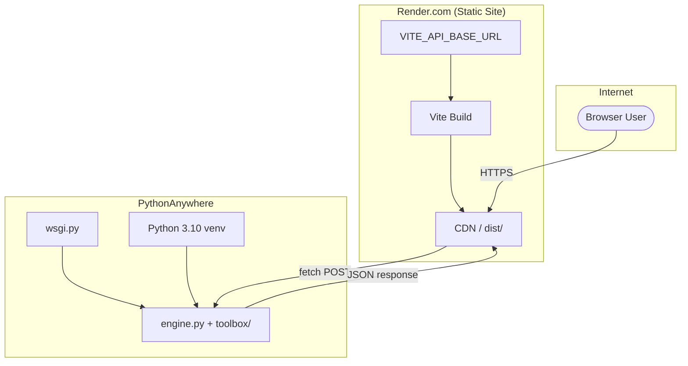

## Analisis Codebase

Proyek ini adalah **monorepo WebGIS** dengan dua komponen terpisah yang saling terhubung lewat HTTP API.



---

### 1. Struktur Repository

| Folder | Peran | Stack |
|--------|-------|-------|
| `webapp-maplibre/` | Front-end peta interaktif | Vite 8, MapLibre GL 5, @terraformer/wkt |
| `spatial-engine/` | Back-end analisis spasial | Flask 3, Flask-CORS, Shapely, PyProj |

Tidak ada konfigurasi deployment (`render.yaml`, `wsgi.py`, `vite.config.js`, `.env`) di repository saat ini.

---

### 2. Front-end (`webapp-maplibre`)

**Entry point utama:** `index.html` → `src/main.js`

**Fitur:**
- Peta globe MapLibre dengan style demo (`demotiles.maplibre.org`)
- Layer vektor: titik kota (`ne.geojson`), polygon pulau (`area.geojson`)
- Layer raster: gambar Gedung Sate (Wikimedia)
- Interaksi:
  - Klik **titik kota** → buffer 1.000 km via API → tampil layer biru
  - Klik **area pulau** → hitung luas via API → tampil di popup
- Kontrol: fullscreen, globe, logo custom (Jabar)

**Halaman tambahan (belum terintegrasi build):**
- `data.html`
- `Asia/Indonesia.html` (menggunakan basemap MAPID dengan API key hardcoded)

**Dependensi build:**

```json
"scripts": {
  "dev": "vite",
  "build": "vite build",
  "preview": "vite preview"
}
```

**Masalah kritis untuk deployment:**

| Issue | Lokasi | Dampak |
|-------|--------|--------|
| URL API hardcoded ke localhost | `areaTool.js`, `bufferTool.js` | Front-end production tidak bisa memanggil back-end |
| Tidak ada `vite.config.js` | root `webapp-maplibre` | Hanya `index.html` yang di-build; halaman lain diabaikan |
| Tidak ada env variable | — | Tidak ada cara aman mengatur URL API per environment |
| `style.css` kosong | `src/style.css` | Tidak blocker, tapi styling minimal |

Contoh hardcoded URL yang harus diubah:

```12:16:webapp-maplibre/src/engine/areaTool.js
    const response = await fetch("http://127.0.0.1:5000/spatial_computation/area", {
        method: "POST",
        headers: {"Content-Type": "application/json"},
        body: JSON.stringify({ geometry: wkt })
    })
```

---

### 3. Back-end (`spatial-engine`)

**Framework:** Flask dengan CORS aktif (semua origin diizinkan)

**7 endpoint REST (semua POST, body JSON):**

| Endpoint | Fungsi |
|----------|--------|
| `/spatial_computation/area` | Hitung luas poligon (geodesic WGS84) |
| `/spatial_computation/distance` | Jarak antar 2 geometri |
| `/spatial_computation/length` | Panjang garis / keliling poligon |
| `/geometry_manipulation/buffer` | Buffer dengan proyeksi Azimuthal Equidistant |
| `/geometry_manipulation/centroid` | Titik centroid |
| `/geometry_manipulation/intersections` | Interseksi 2 geometri |
| `/network_analysis/dijkstra` | Shortest path pada jaringan |

**Dependensi** (`requirements.txt`):

```
flask>=3.0
flask-cors>=6.0
pyproj>=3.0
shapely>=2.0
gunicorn>=21.0   ← tidak dipakai di PythonAnywhere (WSGI built-in)
```

**Masalah kritis untuk deployment:**

| Issue | Dampak |
|-------|--------|
| Tidak ada `wsgi.py` | PythonAnywhere membutuhkan entry point WSGI |
| CORS terbuka ke semua origin | Berfungsi, tapi kurang aman untuk production |
| Tidak ada health-check endpoint | Sulit memverifikasi deploy sukses |

---

### 4. Alur Integrasi Front-end ↔ Back-end

```
User klik fitur di peta
    → GeoJSON dikonversi ke WKT (@terraformer/wkt)
    → fetch POST ke spatial-engine
    → Flask memproses via Shapely/PyProj
    → Response JSON (area_ha, wkt, dll.)
    → Front-end render hasil (popup / layer baru)
```

Saat ini hanya **2 dari 7 endpoint** yang dipakai front-end:
- `/spatial_computation/area`
- `/geometry_manipulation/buffer`

---

## Rencana Deployment

### Fase 0 — Persiapan Code (Wajib Sebelum Deploy)

#### 0.1. Environment variable untuk URL API (Front-end)

Buat file konfigurasi API, misalnya `src/config/api.js`:

```javascript
export const API_BASE_URL = import.meta.env.VITE_API_BASE_URL ?? "http://127.0.0.1:5000";
```

Update `areaTool.js` dan `bufferTool.js`:

```javascript
import { API_BASE_URL } from "../config/api.js";

const response = await fetch(`${API_BASE_URL}/spatial_computation/area`, { ... });
```

Buat `.env.development`:

```
VITE_API_BASE_URL=http://127.0.0.1:5000
```

Buat `.env.production` (jangan commit — set di Render dashboard):

```
VITE_API_BASE_URL=https://USERNAME.pythonanywhere.com
```

#### 0.2. File WSGI untuk PythonAnywhere

Buat `spatial-engine/wsgi.py`:

```python
import sys
import os

project_home = os.path.dirname(os.path.abspath(__file__))
if project_home not in sys.path:
    sys.path.insert(0, project_home)

from engine import app as application
```

#### 0.3. (Opsional) Health check endpoint

Tambahkan di `engine.py`:

```python
@app.route("/health", methods=["GET"])
def health():
    return {"status": "ok"}, 200
```

#### 0.4. (Opsional) Perketat CORS

```python
CORS(app, origins=[
    "http://127.0.0.1:5173",
    "https://NAMA-APP.onrender.com"
])
```

---

### Fase 1 — Back-end ke PythonAnywhere

**Target URL:** `https://USERNAME.pythonanywhere.com`

#### Langkah-langkah

| # | Langkah | Detail |
|---|---------|--------|
| 1 | Buat akun | [pythonanywhere.com](https://www.pythonanywhere.com) — free tier cukup untuk demo |
| 2 | Upload code | Clone repo via Bash console, atau upload folder `spatial-engine/` |
| 3 | Buat virtualenv | `mkvirtualenv --python=/usr/bin/python3.10 spatial-env` |
| 4 | Install dependensi | `pip install -r requirements.txt` |
| 5 | Konfigurasi Web app | Dashboard → Web → Add new web app → Manual configuration → Python 3.10 |
| 6 | Set WSGI file | Edit WSGI config, arahkan ke `wsgi.py` Anda |
| 7 | Set virtualenv path | `/home/USERNAME/.virtualenvs/spatial-env` |
| 8 | Reload web app | Klik **Reload** di dashboard |
| 9 | Verifikasi | `curl https://USERNAME.pythonanywhere.com/health` |

#### Struktur direktori di PythonAnywhere

```
/home/USERNAME/
├── spatial-engine/
│   ├── engine.py
│   ├── wsgi.py
│   ├── requirements.txt
│   └── toolbox/
└── .virtualenvs/spatial-env/
```

#### Catatan PythonAnywhere Free Tier

- HTTPS otomatis (`*.pythonanywhere.com`) — aman untuk dipanggil dari Render
- CPU/bandwidth terbatas — operasi buffer/area besar bisa lambat
- Tidak bisa custom domain (paid plan)
- Web app sleep tidak ada (always-on di free tier, tapi ada batas daily CPU)
- `gunicorn` **tidak perlu** — PythonAnywhere pakai uWSGI/WSGI sendiri

---

### Fase 2 — Front-end ke Render

**Target URL:** `https://NAMA-APP.onrender.com`

#### Langkah-langkah

| # | Langkah | Detail |
|---|---------|--------|
| 1 | Push repo ke GitHub | Render deploy dari Git |
| 2 | Buat Static Site | Dashboard Render → New → Static Site |
| 3 | Connect repository | Pilih repo proyek |
| 4 | Set Root Directory | `webapp-maplibre` |
| 5 | Build Command | `npm install && npm run build` |
| 6 | Publish Directory | `dist` |
| 7 | Environment Variable | `VITE_API_BASE_URL` = `https://USERNAME.pythonanywhere.com` |
| 8 | Deploy | Render otomatis build & publish |
| 9 | Verifikasi | Buka URL Render, klik fitur peta, cek Network tab |

#### Konfigurasi Render (via `render.yaml` — opsional)

Buat di root repo:

```yaml
services:
  - type: web
    name: webgis-frontend
    runtime: static
    rootDir: webapp-maplibre
    buildCommand: npm install && npm run build
    staticPublishPath: dist
    envVars:
      - key: VITE_API_BASE_URL
        sync: false   # set manual di dashboard
    routes:
      - type: rewrite
        source: /*
        destination: /index.html
```

#### Catatan Render Static Site

- Build otomatis saat push ke branch terhubung
- HTTPS gratis
- Free tier: cold start tidak relevan untuk static site (file di-serve langsung)
- Env var `VITE_*` di-inject saat **build time**, bukan runtime — set sebelum deploy

---

### Fase 3 — Verifikasi End-to-End

**Checklist testing setelah deploy:**

```
□ https://USERNAME.pythonanywhere.com/health → {"status": "ok"}
□ curl POST /spatial_computation/area → response JSON valid
□ https://NAMA-APP.onrender.com → peta tampil
□ Klik polygon pulau → popup menampilkan luas (ha)
□ Klik titik kota → layer buffer biru muncul
□ Browser DevTools → Network → tidak ada error CORS
□ Browser DevTools → tidak ada Mixed Content error
```

**Test CORS manual:**

```bash
curl -X OPTIONS https://USERNAME.pythonanywhere.com/spatial_computation/area \
  -H "Origin: https://NAMA-APP.onrender.com" \
  -H "Access-Control-Request-Method: POST" \
  -v
```

---

## Diagram Deployment Final



---

## Risiko & Mitigasi

| Risiko | Severity | Mitigasi |
|--------|----------|----------|
| URL API hardcoded | **Tinggi** | Refactor ke `VITE_API_BASE_URL` (Fase 0.1) |
| CORS error cross-origin | **Tinggi** | Pastikan Flask-CORS aktif + origin Render di-whitelist |
| PythonAnywhere CPU limit | Sedang | Buffer 1.000 km berat; pertimbangkan kurangi `distance_m` untuk demo |
| Multi-page HTML tidak ter-build | Sedang | Tambah `vite.config.js` jika perlu deploy `Asia/Indonesia.html` |
| API key MAPID exposed | Rendah | Hanya di halaman secondary; rotasi key jika perlu |
| GeoJSON besar (`area.geojson`) | Rendah | Pertimbangkan simplify geometry untuk performa |

---

## Urutan Eksekusi yang Disarankan

```
1. Refactor URL API → env variable          (±30 menit)
2. Buat wsgi.py + health endpoint           (±15 menit)
3. Deploy back-end ke PythonAnywhere        (±45 menit)
4. Test API production dengan curl
5. Set VITE_API_BASE_URL di Render
6. Deploy front-end ke Render               (±30 menit)
7. End-to-end testing di browser
```

---

## File yang Perlu Dibuat/Diubah (Ringkasan)

| File | Aksi |
|------|------|
| `webapp-maplibre/src/config/api.js` | **Buat baru** |
| `webapp-maplibre/src/engine/areaTool.js` | **Edit** — ganti hardcoded URL |
| `webapp-maplibre/src/engine/bufferTool.js` | **Edit** — ganti hardcoded URL |
| `webapp-maplibre/.env.development` | **Buat baru** |
| `spatial-engine/wsgi.py` | **Buat baru** |
| `spatial-engine/engine.py` | **Edit** — tambah `/health`, optional CORS |
| `render.yaml` | **Opsional** — otomatisasi Render |

---
